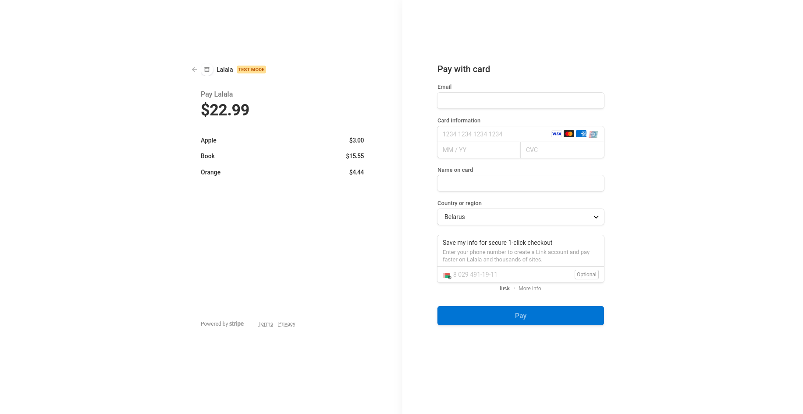

# Project run

These steps suppose you have docker-compose installed.

## Env configuration

Go to https://dashboard.stripe.com/test/apikeys, copy your API keys and paste to .env file:

```commandline
SECRET_API_KEY=Your-Secret-key
PUBLIC_API_KEY=Your-Publishable-key
SECRET_KEY=django-insecure-d()wo(_gc(1&n8(#a@s1c&34gv@!q2y_wcc0r0k&q2dh+w*4&+
```

# Build/Run container
```commandline
docker-compose build
docker-compose up
```

# Get created container Name/ID
Open new terminal and run:
```commandline
docker container ls
```
Copy created container Name or ID.
# Run migrations
```commandline
docker exec -it CREATED_CONTAINER_NAME/ID sh
python manage.py makemigrations
python manage.py migrate
```

# Create superuser
```commandline
docker exec -it CREATED_CONTAINER_NAME/ID sh
python manage.py createsuperuser
```
# Usage

Open http://127.0.0.1:8000/admin/ in your browser and login by created credentials.

Go to Items section and add new items:


open http://127.0.0.1:8000/item/{item_id}/ in your browser:


Try make test purchase, press buy button and use [test](https://stripe.com/docs/testing) card data.


You can buy several items, go to admin panel and create new Order.


Open http://127.0.0.1:8000/buy/order/{order_id}/ and you see your Order information:


If you want, you can specify discount for order in Admin panel.